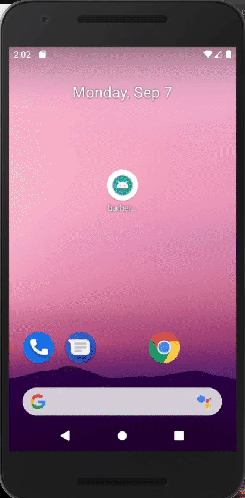

# Aplicativo React Native - barberAPP

# 

### Este aplicativo é um exemplo de rotina de login e cadastro de usuário
Foram utilizados:
   * Styled Components;
   * Svg-transformer;
   * Stack Navigation;
   * Bottom Tab Navigation (com tab custom);
   * AsyncStorage;
   * Requisição a API (usando fetch);
   * Manipulação de contexto (usando useContext).

Serve como um breve exemplo de:
- [x] Exemplo de tela de login;
- [x] Exemplo de app usando Styled Components;
- [x] Exemplo de Stack Navigation
- [x] Exemplo de Bottom Tab Navigation custom.
